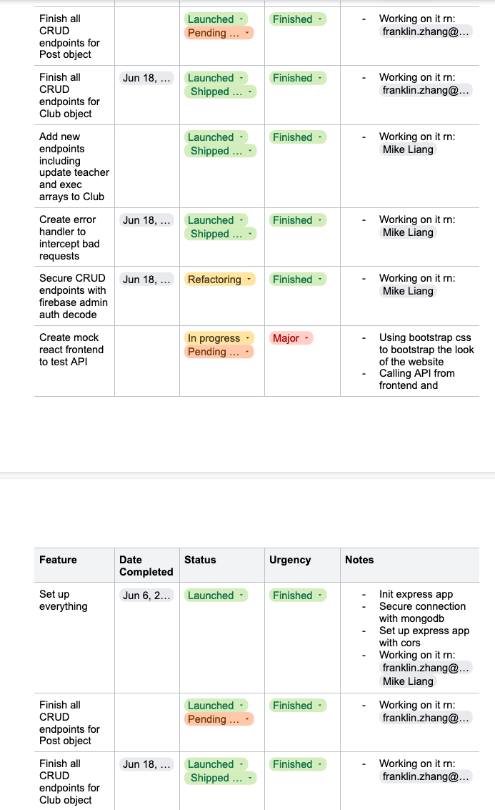

# AYJ Club Website redesign preliminary codebase

## **TOC**
* [Documentation and Files](#documentation-and-files)
	* [Why use AirBnB's style guide for JS?](#why-use-airbnbs-style-guide-for-js)
	* [Why use JSDoc?](#why-use-jsdoc)
* [Demonstration of Class Learning](#demonstration-of-class-learning)
	* [Demonstration of Modular Programming](#demonstration-of-modular-programming)
	* [Demonstration of AGILE Development](#demonstration-of-agile-development)
* [Additional Libraries](#additional-libraries)

## Documentation and Files 

For this project, we used Javascript as the main language of choice and the documentation will follow using [JSDoc3](https://jsdoc.app/). The code style follows the [AirBnB](https://github.com/airbnb/javascript) Javascript Style Guide, using ESLint as the main tool to lint and enforce the style guide in both our Node.js/Express.js app and the React.js app.

> **Files to check for proper documentation and code**
> - []()
> - [Club.js commenting, Mike](https://github.com/ayj-develops/server-master/blob/main/api/club.js)

### Why use AirBnB's style guide for JS?

It's mostly reasonable, makes sense and eliminates a lot of common mistakes that would cause headaches when refactoring. It also includes a lot of rules and is extremely comprehensive for both ES6 and Commons JS. In any case, it was a matter of finding a style guide we would adhere to, so that it would streamline the development workflow.

- [AirBnB Style Guide Link](https://github.com/airbnb/javascript#types)

### Why use JSDoc?

Similar to JavaDoc comments, JSDoc allows us to add markup to annotate Javascript files, which makes documenting functions and reading them as plaintext much easier. 

This tool introduces more features than JavaDoc because it includes a lot more annotations that are more detailed:

Ex.

```javascript
/**
 * Represents a book.
 * @constructor
 * @param {string} title - The title of the book.
 * @param {string} author - The author of the book.
 */
function Book(title, author) {
}
```

Whereas in Java, the `{string}` typedef would be omitted. 

This improves readability of our code, especially when there is a lot of high level abstraction with the API and server.


## Demonstration of Class Learning

This project uses many different objects and classes to organize the different models and abstract data types the server has.

For example, a custom written error handler middleware intercepts errors by defining classes for each type of error with a GeneralError class that is the superclass of the other error types, but itself is a subclass of Express.js's Error class.

In the error handler middleware, runtime polymorphism is shown. It compares whether the error received is an instance of General Error, which is the superclass that encapsulates all of the smaller and more specific subclasses for errors.

Link to the error handler classes here: [Link](https://github.com/ayj-develops/server-master/blob/v2/middleware/error.js)
Link to the error handler middleware here: [Link](https://github.com/ayj-develops/server-master/blob/v2/middleware/errorHandler.js)

### Demonstration of Modular Programming

Both the frontend (mock) and server extensively use the concept of modular programming. Each API endpoint is its own separate 'component', which in essence is a Javascript function. However, functions in Javascript are treated as objects, so while one endpoint might break, there is no dependency from that 'module/component' to another endpoint. This means that each endpoint plugs into the server in a modular fashion.

For example, in the app.js file it's show very clearly:

```javascript
const app = express();

const clubRouter = require('./api/club');

app.use(`${API_ROUTE}/clubs`, clubRouter);

const postRouter = require('./api/post');

app.use(`${API_ROUTE}/post`, postRouter);

const handleErrors = require('./middleware/errorHandler');

app.use(handleErrors);
```

As shown, the `app` is an express app object, and calling the use() function plugs in the 'component/module' function from that respective file into the app. By omitting any one of these would still allow the app to run.

Another example would be the endpoints that also show modular programming. Each endpoint is separated into 'modules/components' that can be independent and interchangeable.

```javascript
/**
 * Filter clubs through their slug
 */
router.get('/club/slug/:slug', jsonParser, async (req, res, next) => {
  ...
});

/**
 * Retrieve all clubs
 */
router.get('/all', jsonParser, async (req, res, next) => {
  ...
});
```

These endpoints are not connected to each other, which means that if one of them breaks, they are independent, so the server would still be running.

Another way is through the custom middleware such as the Firebase Authentication middleware to intercept request headers and make sure that the token is valid before hitting an API endpoint, or the Error handling middleware. Both of these are completely independent from the other part of the program as well, which means that if needed, we can remove the middleware from the app without deleting the middleware files or impacting the rest of the functionality.

### Demonstration of AGILE development

Like we mentioned in our project proposal, we used a modified Kanban tool to get a general overview of where we were at, at all times. That being said, the workflow we were using was not strictly Kanban. It was more AGILE Scrum + DevOps and Kanban. This mix allowed us to continually evaluate and shift directions, which we did multiple times and stay on top of the features that we were rolling out. 

In our Google Drive, we used multiple documents to keep track of the features we were rolling out, as well as the tasks. Not only did we have a Daily Work Log, which provided us with a complete and specific assessment of the day-to-day, but also a modified Kanban that combined Shipping, Refactoring and Priority into one table that could be easily viewed.



Additionally, the Sprint interviews gave us another view on how we were conducting development for that week, and that combined with the original workflow of an AGILE Scrum type workflow allowed us to quickly pivot and change directions for the development of this program to meet the needs of the next sprint interview or client interview.

## Additional Libraries

Our dependency list for the backend

```json
"body-parser": "^1.20.0", // better parse request bodies
"compression": "^1.7.4", // reducing the size of api responses
"cors": "^2.8.5", // securing resource sharing across domains
"dotenv": "^16.0.1", // retrieving environment secrets
"eslintrc": "^1.0.6", // linting and style enforcing
"express": "^4.18.1", // node.js lightweight server
"firebase-admin": "^11.0.0", // server side authentication
"helmet": "^5.1.0", // securing the headers of this app
"http": "^0.0.1-security", // dependency of dependency
"mongoose": "^6.3.5", // ORM for interacting with the mongo driver
"nodemon": "^2.0.16", // file watching during development
"object-hash": "^3.0.0", // hash objects
"path": "^0.12.7", // retrieving assets
"slugify": "^1.6.5" // slugify names
```

Our dependency list for the frontend (mock)

```json
"@babel/preset-env": "^7.18.2", // default
"@testing-library/jest-dom": "^5.16.4", // default
"@testing-library/react": "^13.3.0", // default
"@testing-library/user-event": "^13.5.0", // default 
"axios": "^0.27.2", // fetching data
"bootstrap-icons": "^1.8.3", // bootstrap icons
"eslint": "^8.17.0", // listing and enforcing style
"firebase": "^9.8.3", // client side auth firebase
"flowbite": "^1.4.7", // Flowbite ui css
"flowbite-react": "^0.0.26", // Flowbite ui components 
"jquery": "^3.6.0", // jquery yes
"node-sass": "^7.0.1", // compile sass from node
"object-hash": "^3.0.0", // hash objects
"path": "^0.12.7", // retrieving assets
"react": "^18.1.0", // react
"react-dom": "^18.1.0", // react dom
"react-icons": "^4.4.0", // icon pack
"react-router-dom": "^6.3.0", // routing within react dom
"react-scripts": "5.0.1", // comes with react
"web-vitals": "^2.1.4" // comes with react
```
