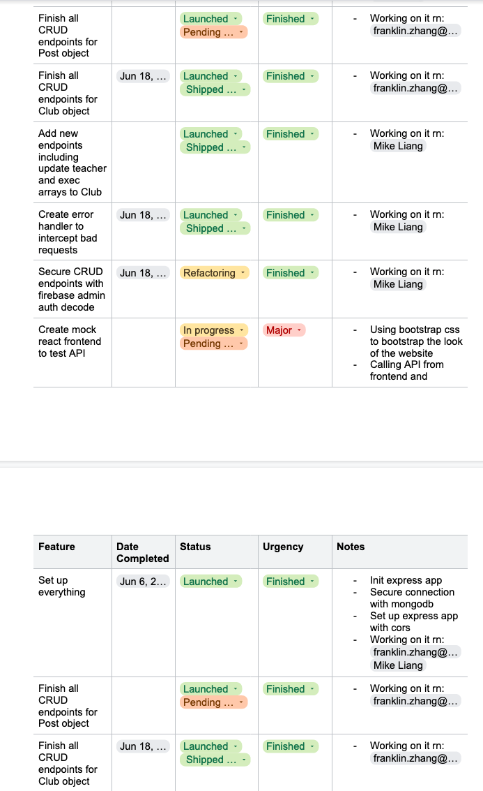
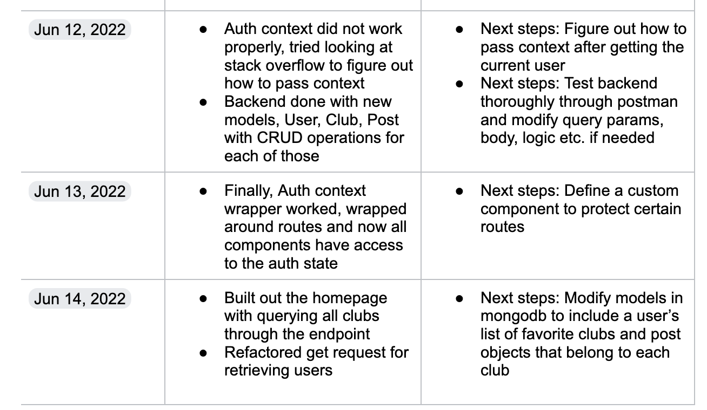

# What knowledge or skills did you learn?

There's a lot of things I learned over the course of this culminating project, especially in terms of product (not just project) management, leading people towards a goal or many goals and communicating how I believe aspects of the project or development roadmap should be chagned as well as listening and incorporating team member's ideas.

In addition, before I wasn't as familiar with any of the frameworks because I hadn't completed a large project or anything using those frameworks, so my knowledge of how to use them properly, dependencies, libraries etc. were very limited.

Through this experience I've been able to develop not only my hard skills in writing clean readable code, documenting code, but also been able to develop my soft skills in communicating with the VP, with Mr. Lee during the interviews and with my team daily to ensure the direction of the project was aligned with our goals. 

For example, I've noticed that I was able to present more and more without being nervous or needing to prepare all that much, which I think will carry forward into the future since a lot of work requires presenting and communicating with different people on a daily basis. Being able to voice my ideas or present them in a way that is easily digestable by other people will go a long way.

On the language side, I did not know that you could destructure so many things in Javascript. In addition Javascript has functions within functions within functions which makes for a very interesting but completely readable code. 

Ex.

```js
MongoObj.find({}, (err, obj) => {
  // something
}).then((res) => {
  res.get(() => {});
});
```

In addition, Javascript has some things that are also only Javascript. Comparisons use `===` and `!==` to compare exact values while `==` and `!=` compare the value types. Not only that but the style guides for Javascript are endless and it also varies from framework to framework. 

The main takeaway from the language I learned was that it is incredibly flexible and high level. At least for me, I found it really easy to understand because it was so abstracted and quick to implement, hence a quicker development time and easier when we need to change directions.
 
Some of the more niche things I learned through this project was dealing with RESTful APIs. This included writing them, documenting them, interacting with them, and building them in such a way that it would efficiently return data as well as make sure that the APIs themselves are self-explanatory. This directly ties in with my building up of knowledge for the framework Express.js and how to use modular programming to address these API endpoints.

In addition to learning more about HTTP and RESTful APIs, I learned a lot about different databases as well and which one would be a good fit for our usecase. For example, rigid data would be suited best in SQL type databases like Postgresql, CockroachDB etc. while not as rigid and rapidly changable data should use SQLess databases like Firestore or MongoDB.

As for additional classes and libraries, Javascript in this case, we used a lot of different open source libraries, each including many classes. Some of them include large frameworks like Express.js and React.js. Other smaller ones include Firebase, Firebase admin etc. All of those helped to build the application in the end, Firebase provided tools for us to use for authentication, while a dependency like mongoose provided an abstraction layer for when we're interacting with the database.

In greater detail, I learned specifically how to guide a team towards the overall goal while achieving smaller ones along the way. For example, in the presence of upcoming meeting dates or checkpoints during our sprints, I learned to make specific decisions that would alter the course of the project short term to hit the specific goals that were required for those meetings or checkpoints.

These decisions were a great experience for me because I now have a greater ability in boiling down many goals and isolating the most important ones to reach for a specific period. During that time, I now realize that clear efficient communication is key to staying on top of things. So we had a lot of Discord calls as well as a face-to-face out of school meeting to go over the project requirements and where it was headed.

Aside from these soft skills, I also learned how to better keep track of our daily work and improve my descriptions of what we did during that sprint or for those few days. In addition to that, I am now very familiar with how to keep track using AGILE project tools like Kanban and setting feature statuses such as 'Shipped', 'Pending refactor', 'Bug fix', 'Urgent' etc. The use of such an AGILE methodology allowed us to stay on top of every requirement and meeting points that were presented as next steps.



Time management also goes hand in hand with project management because without being able to schedule and co-ordinate feature delivery on a set basis or time, we would not have been able to shift directions whenever we needed to, or roll out features. This would've impacted our efficiency and we definitely would not have been able to get to where we are right now without a detailed calendar and clear goals set day after day.

Rather than have a larger goal like a weekly one to hit, we would instead use functional goals that define very specifically what we should be focusing on for those few days or for that day. For example, some of the goals were listed in our 'Next-steps' in our daily worklog which outlined the next things we should be focusing on. These goals were entirely functional meaning that they were specific instead of "start working on...". 



This made our work very efficient since everything was done in managable chunks over any period of time.

# What problems did you overcome?

As for problems, there was a lot to say the least. Both of us were working with frameworks that were less than familiar to us so we had to learn the framework as we went along which led to a lot of problems.

For example on the backend side, one of the recent problems was the format of the errors. While this did not break the server, it did not conform to our requirements for a RESTful API; since it has to return a JSON format. This in turn bypassed our Error Handler middleware which means it never returned valid status codes. The cause of that problem was actually MongoDB directly returning an error because of Schema side validation, so to solve that we removed any requirements in the Schema, and instead set it as our next step to "Write endpoint validation to filter request fields".

Another problem was 

As you might see, there were many problems we encountered but a lot of them was solved through reading the documentation (which was quite extensive) and also 
